## 简介

- **aliyun-iot-home**是一个基于阿里云平台 `sdk` 开发的一个**智能家居系统**

### 主要技术

#### 软件部分

- `python`：项目开发语言和运行环境
- `MQTT`：客户端和云平台之间的信息传输（上传、下发）协议
- `json`：客户端和云平台之间的信息传输载体，信息通过对`json`数据的传输和解析完成
- `TLS`&`CA`：保证信息安全性，使用 `TLS` 非对称加密和 `CA` 证书保证用户信息的安全性

#### 硬件部分

- `GPIO`：树莓派采用 `GPIO` 接口进行信号传输，硬件部分
- `raspberry pi`：树莓派作为连接本地设备和控制平台的连接枢纽

### 项目模型
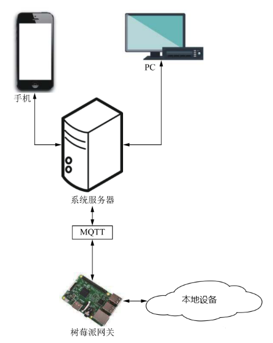

### 支持的协议

- [x] MQTT
- [x] HTTP

### 开发环境选择

#### 需求

- 需要具有灵活易用
- 需要易于搭建
- 需要快速完成
- 跨平台：需要在 `windows` 上开发，树莓派系统 `Raspbian` 上运行

#### 选择

- 考虑到以上几点，考虑使用 `python3` 环境进行搭建
- 考虑到 `MQTT` 协议具有开销较小等优点，**该项目采用 `MQTT` 协议**

### 详细介绍

#### 数据后台管理

##### 成品演示 GIF


##### 项目展示

- 后台
  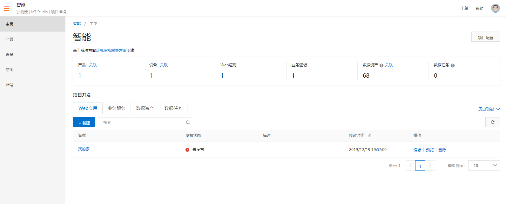
- 前台
  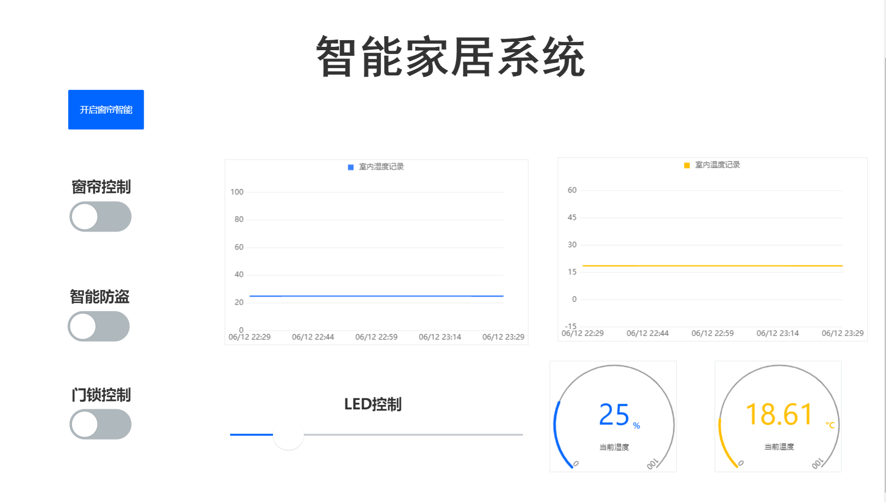
- 设备
  | 设备信息 | 设备状态 |
  | :----: | :---: |
  | 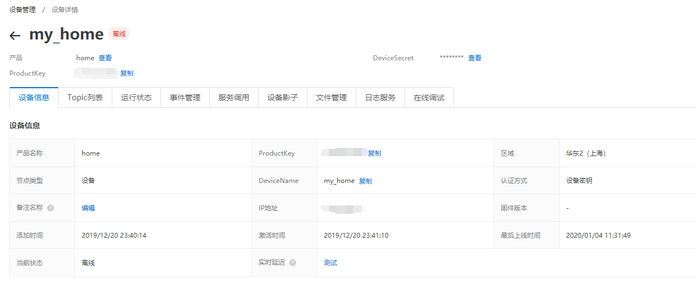 | 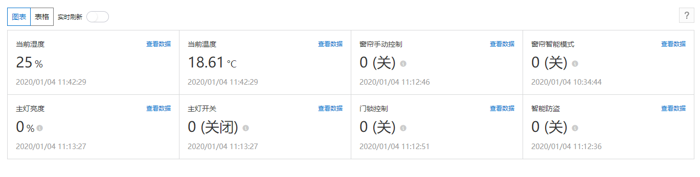|

- 产品
  | 产品信息 | 产品 Topic |
  | :---------------------------------------------: | :-----------------------------------------------------------------: |
  | 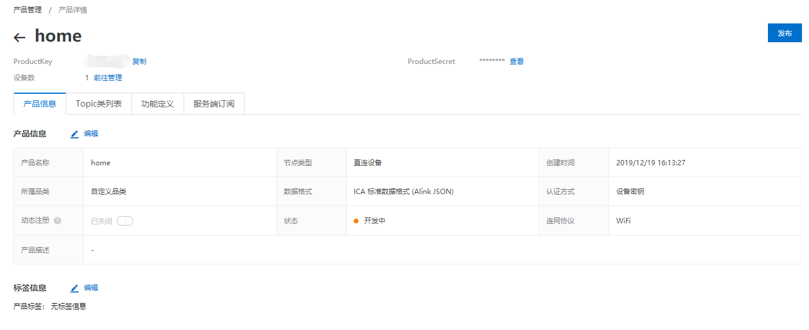 | 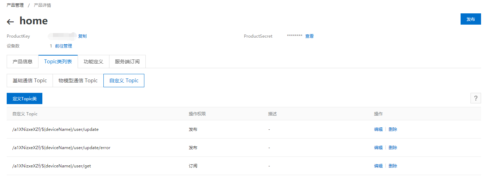 |
  | **标准功能** | **自定义功能** |
  | 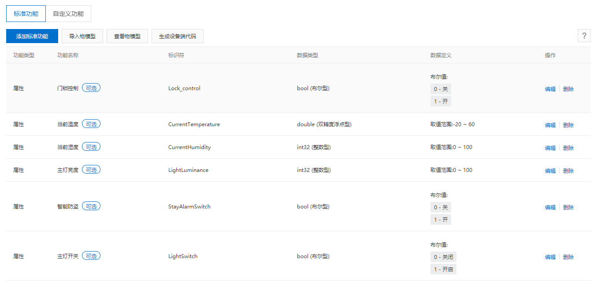 | 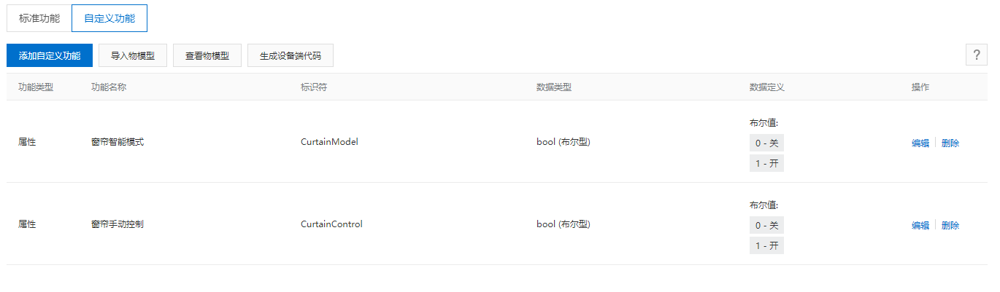 |

##### APP 展示

- |              APP 图标              |               APP 主页                |         环境状态          |          家居控制          |
  | :--------------------------------: | :-----------------------------------: | :-----------------------: | :------------------------: |
  | 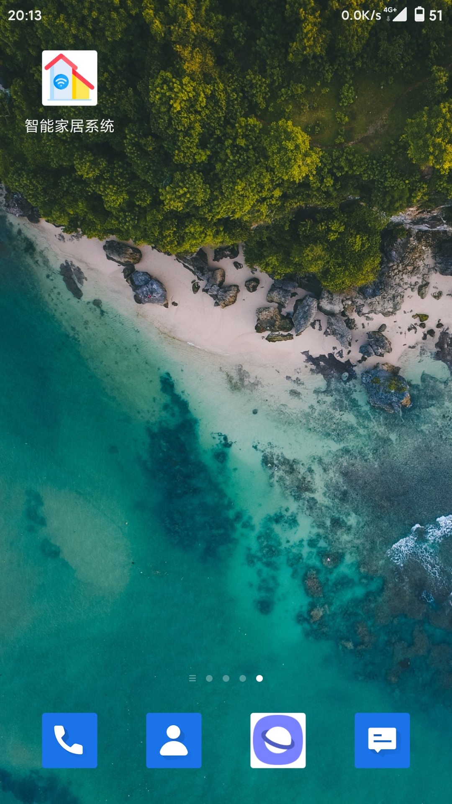 | 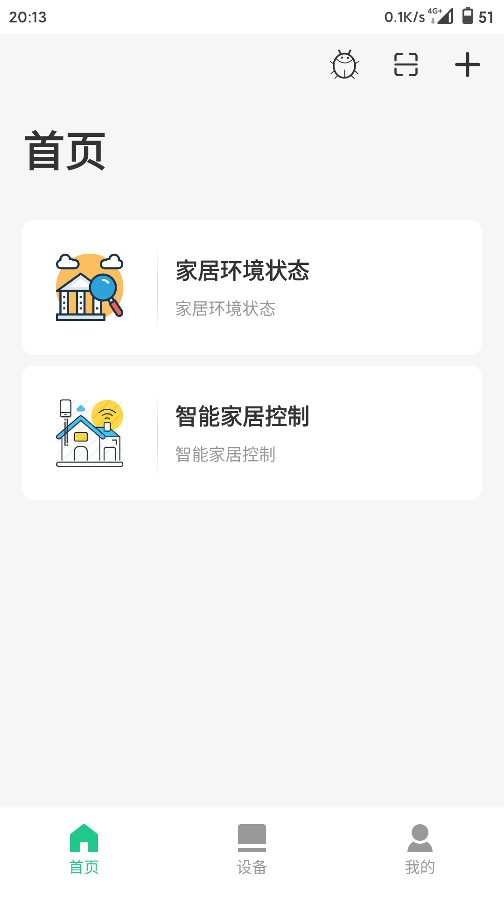 | 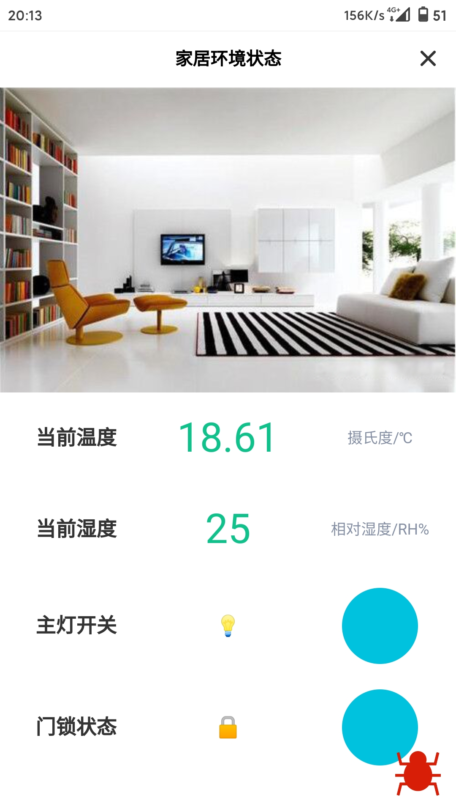 | 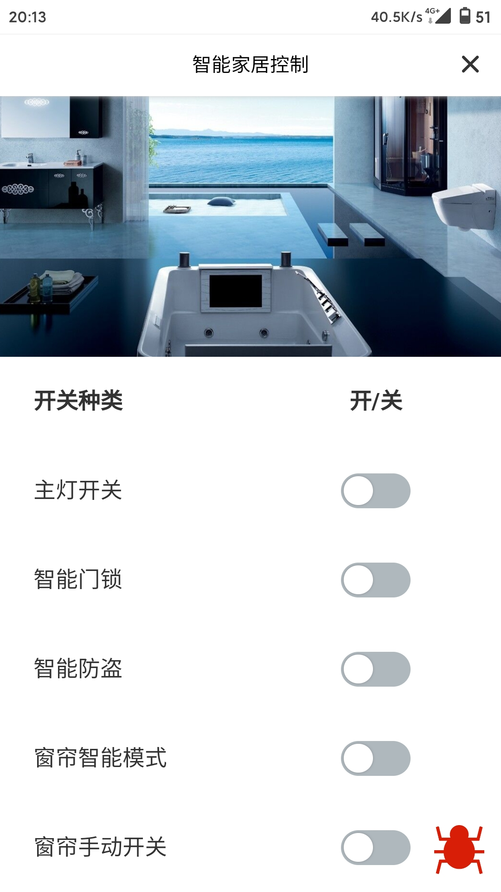 |

##### 实物展示

| 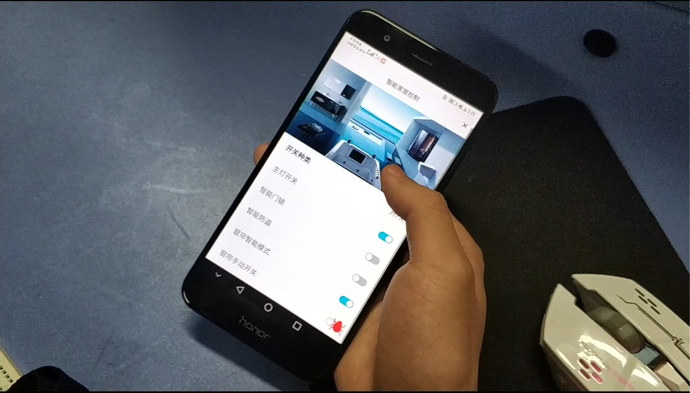 | 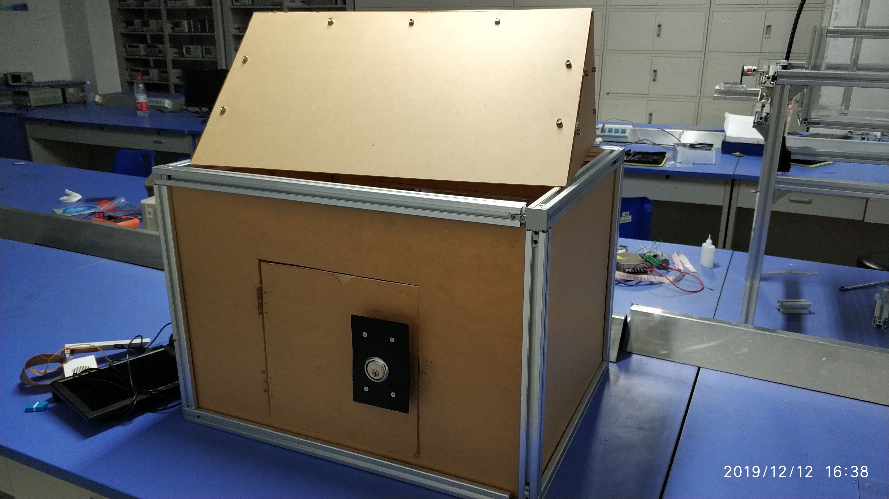 | 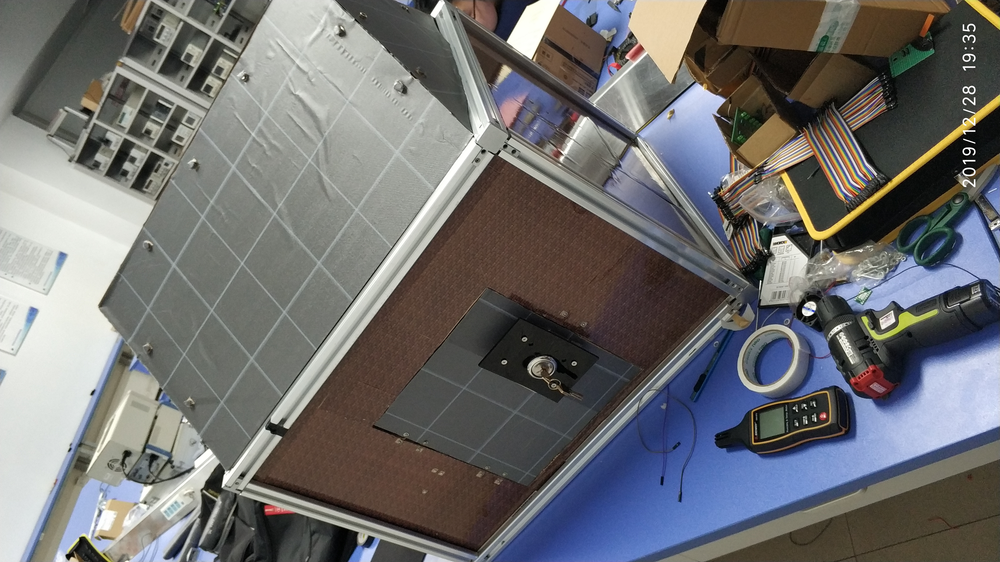 |
| :-------------------------: | :-------------------------: | :-------------------------: |
|  | 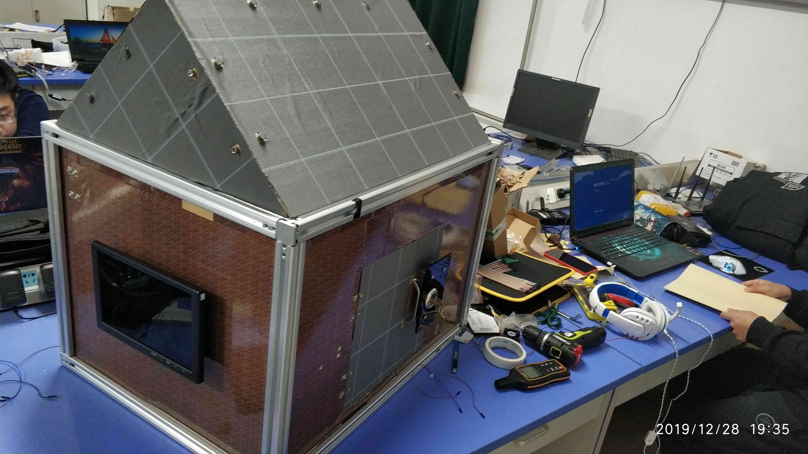 | 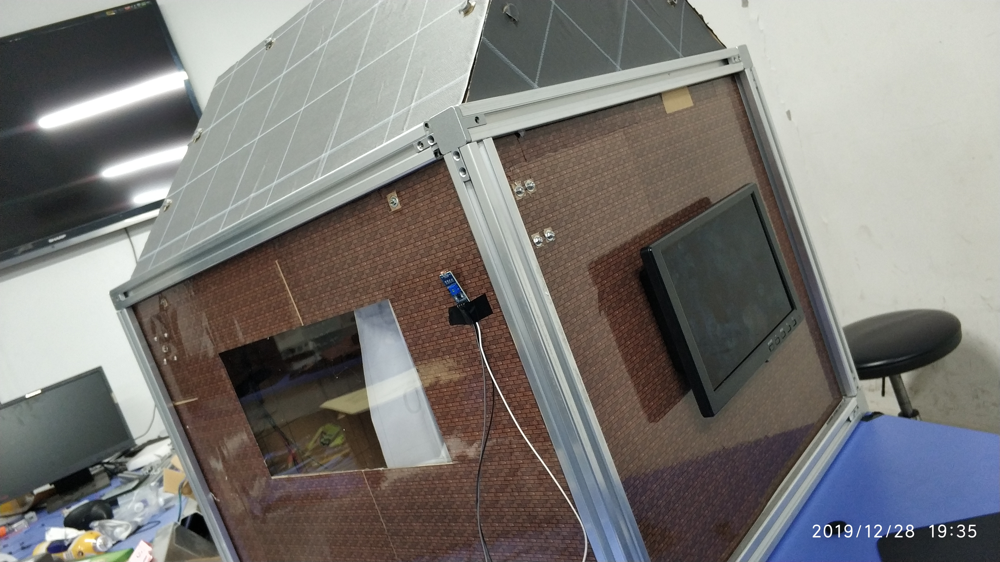 |
|  | 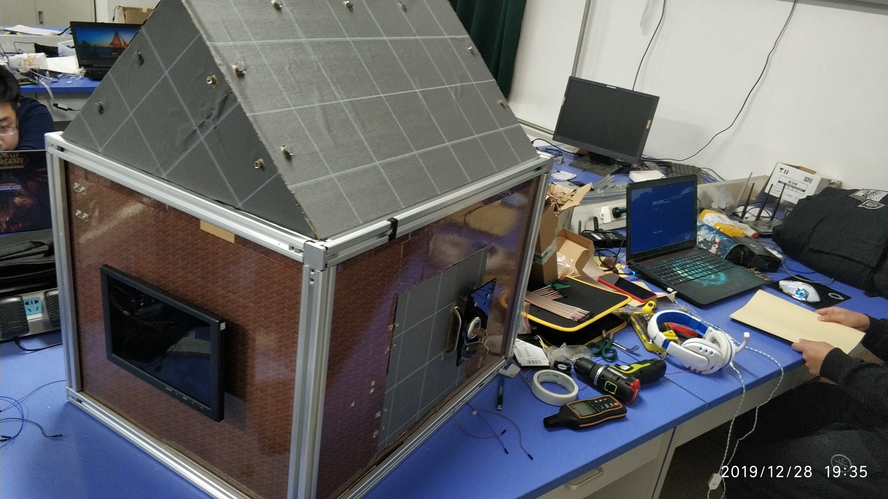 | 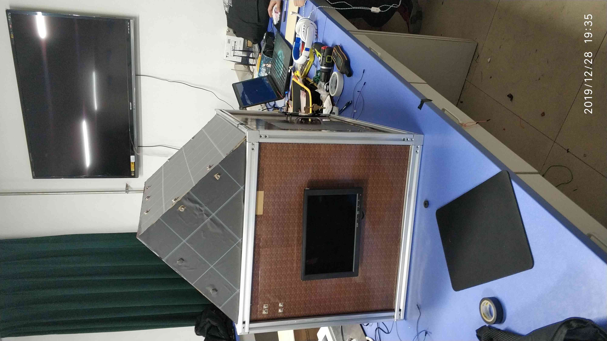 |

### 使用注意事项

- 使用 `http` 协议进行通讯时，需要 `token` 进行认证，`SDK` 默认使用内存型缓存（`cache-tools` 方案）进行 `token` 的保存。

- ```python
  #如果需要自行进行其他方案进行保存（file/memcached/redis），获取 token时，使用
  iot.get_token(cache=False) ，
  #publish 消息时，使用
  iot.publish(payload=payload, token=token)
  ```
